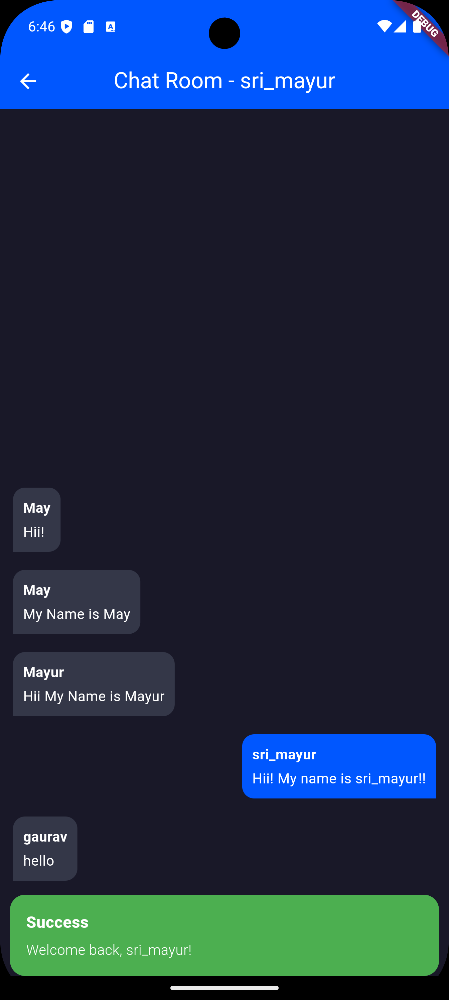
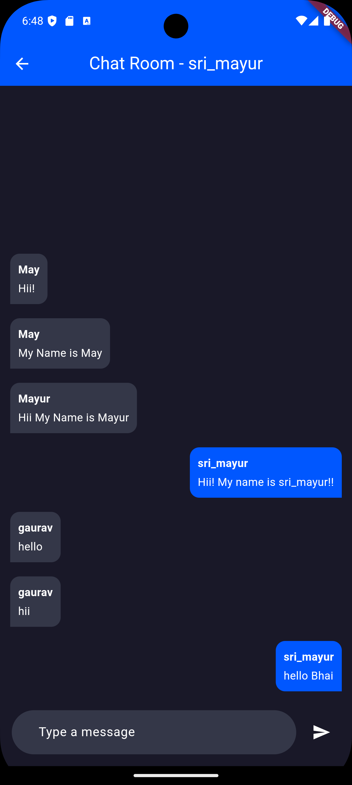
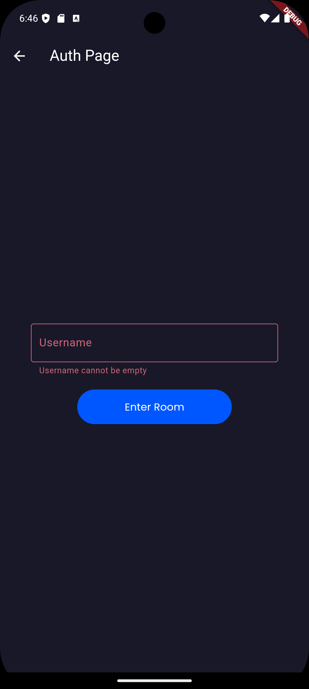

# MayChat

**MayChat** is a real-time chat application built using Flutter, GetX, and Firebase. It allows users to join chat rooms and exchange messages seamlessly. The app provides a modern UI with real time chatting.

## Features

- **User Authentication**: Secure and seamless login/signup process.
- **Real-time Messaging**: Chat with other users in real-time.
- **Chat Rooms**: Enter rooms using a username and start chatting.
- **Firestore Integration**: Stores and retrieves messages from Firebase Firestore.
- **State Management**: Managed efficiently using GetX.

## Screenshots

### Welcome Screen


### Welcome Screen 2


### Chat Room


### Chat Room 2


### Login Screen


## Tech Stack

- **Flutter**: For building the UI.
- **GetX**: State management and routing.
- **Firebase**: Backend services for authentication and Firestore.
  - Firebase Core
  - Firebase Firestore
  - Firebase Authentication
- **Dart**: Programming language for Flutter.

## Project Structure

```plaintext
lib/
├── Config/
│   ├── PagePath.dart    # Manages app routes
│   ├── Themes.dart      # Theme configuration (light/dark)
├── Pages/
│   ├── SplashPage/      # Splash screen
│   ├── WelcomeScreen/   # Welcome screen for user login or entry
├── Room/
    ├── RoomPage.dart    # Chat room for messaging
├── Authentication
    ├── Auth.dart        # Contains AuthController and authentication logic
├── main.dart            # App entry point
